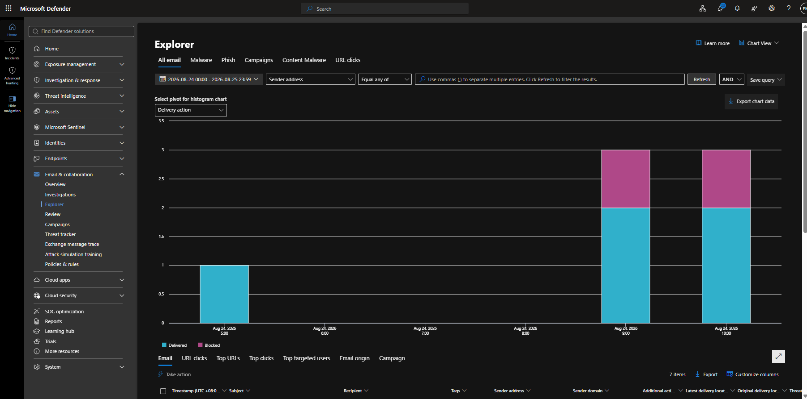
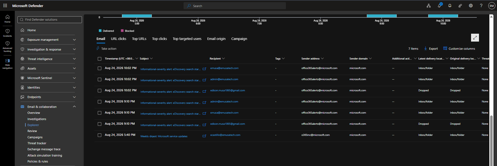
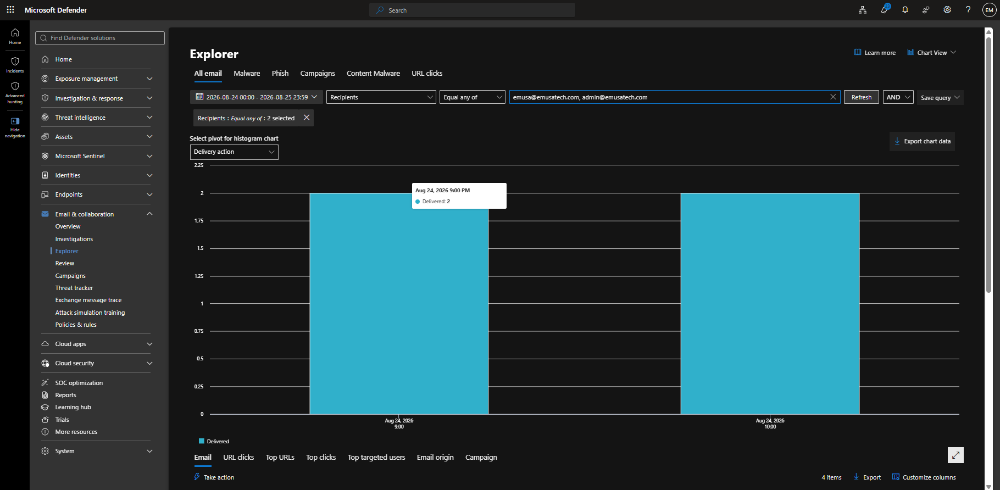
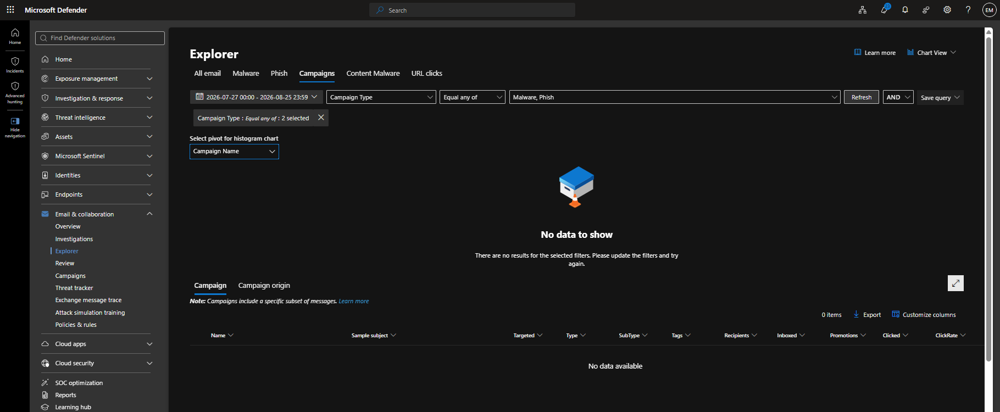
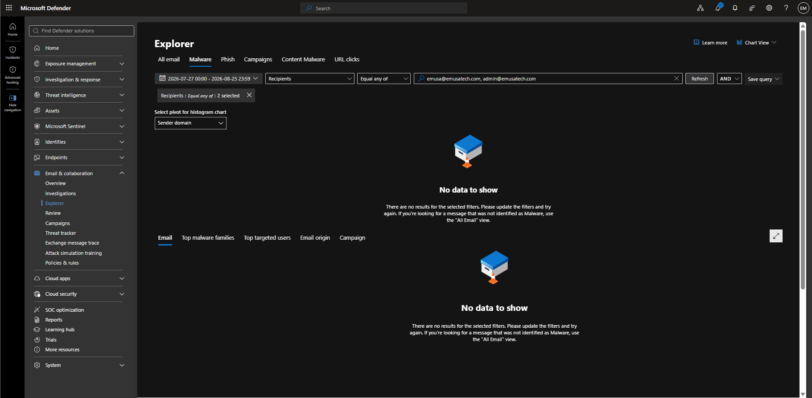
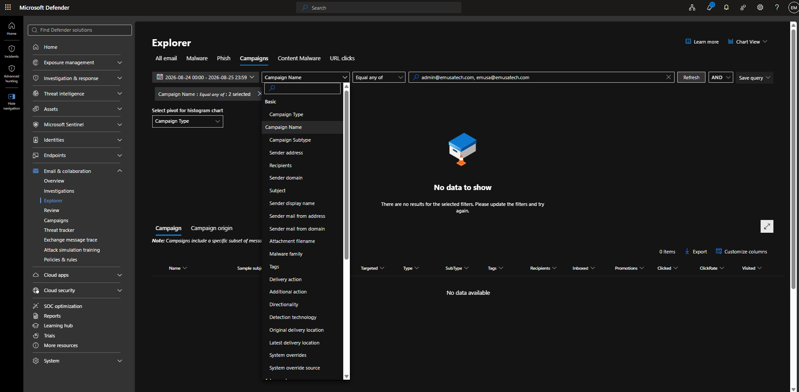

# Use Threat Explorer

## Overview

Microsoft Defender Threat Explorer provides visibility into email threats, message activity, malware detections, phishing attempts, and delivery actions across the Microsoft 365 environment. Administrators can use Threat Explorer to investigate suspicious messages, analyze trends, and support incident response activities.

## Location

**Microsoft Defender Portal → Email & Collaboration → Explorer**

## Steps

1. Signed in to the Microsoft Defender Portal using an administrator account.
2. Navigated to **Email & Collaboration**.
3. Selected **Explorer**.
4. Opened the Threat Explorer dashboard.
5. Selected the investigation timeframe.
6. Reviewed available investigation categories including Email, Malware, Phish, Campaigns, Content Malware, and URL Clicks.
7. Configured a filter using recipient email addresses.
8. Executed a threat investigation query.
9. Reviewed available message telemetry and threat analysis options.
10. Validated available filtering capabilities for malware investigation.
11. Reviewed investigation results.
12. Observed that no malware detections or threat-related results were available in the lab environment during the selected timeframe.

## Result

Microsoft Defender Threat Explorer was successfully accessed and configured for threat investigation activities. At the time of testing, no malware-related results were available in the lab environment, indicating that no qualifying threat events had been detected within the selected search scope and timeframe.

### Access Threat Explorer

### Run Threat Investigation

### Configure Threat Explorer Filters

Threat Explorer enables administrators to investigate email threats, phishing attempts, malware detections, and message delivery actions across Microsoft 365.

Microsoft Defender for Office 365 provides advanced filtering and investigation capabilities that help security teams identify, analyze, and respond to email-based threats.

New or low-activity lab environments may not contain sufficient threat telemetry to generate meaningful Threat Explorer results. Administrators should continue monitoring email activity and security events to build investigation data over time.