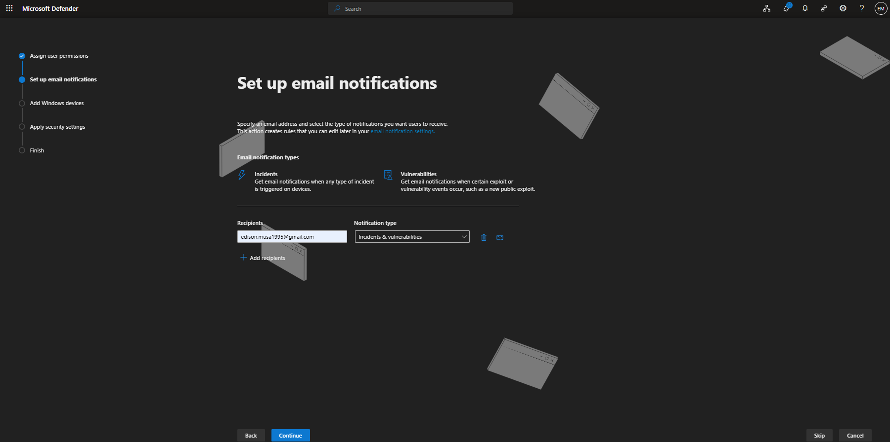
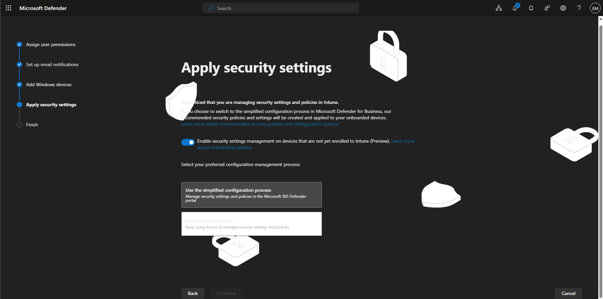
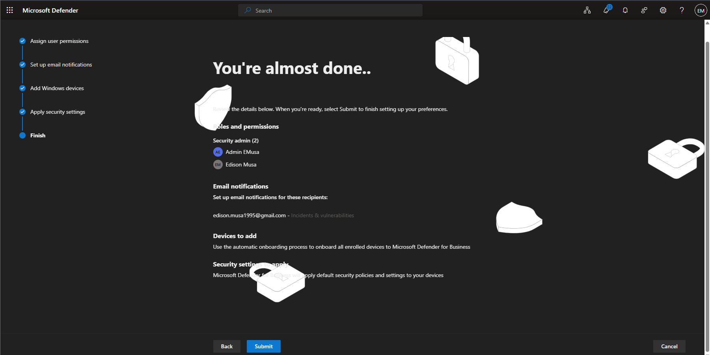
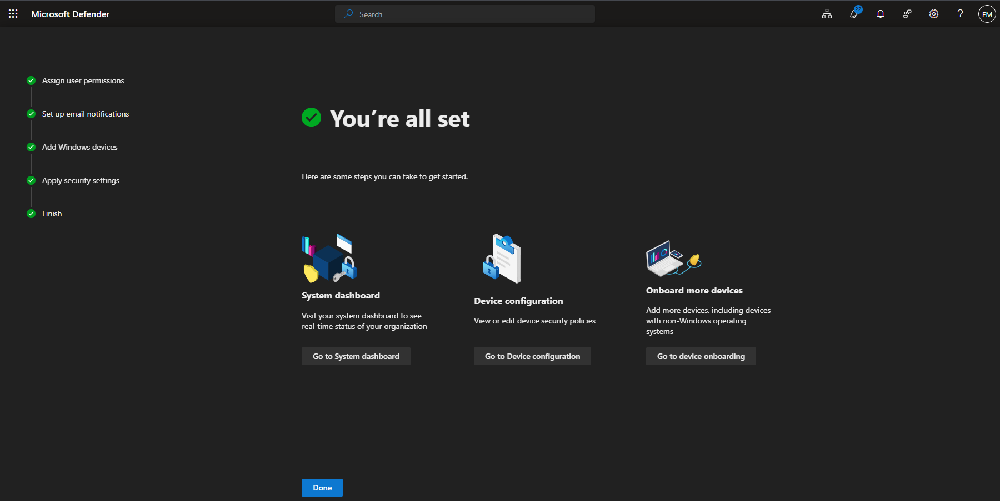
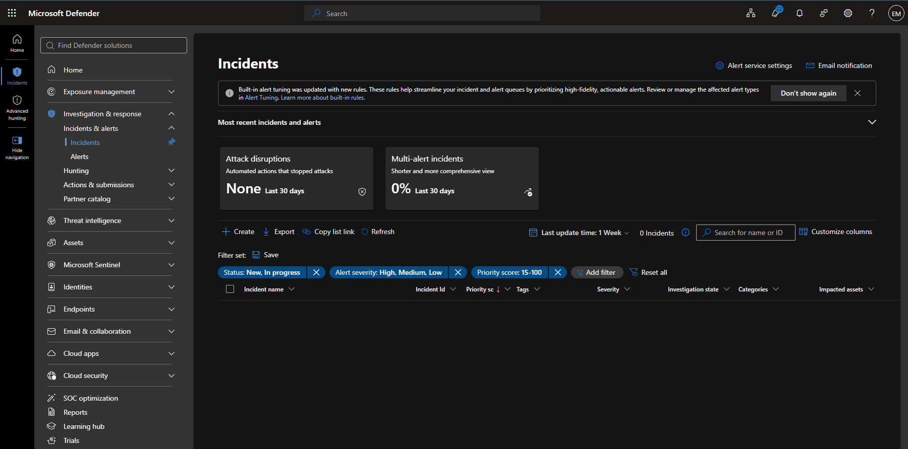
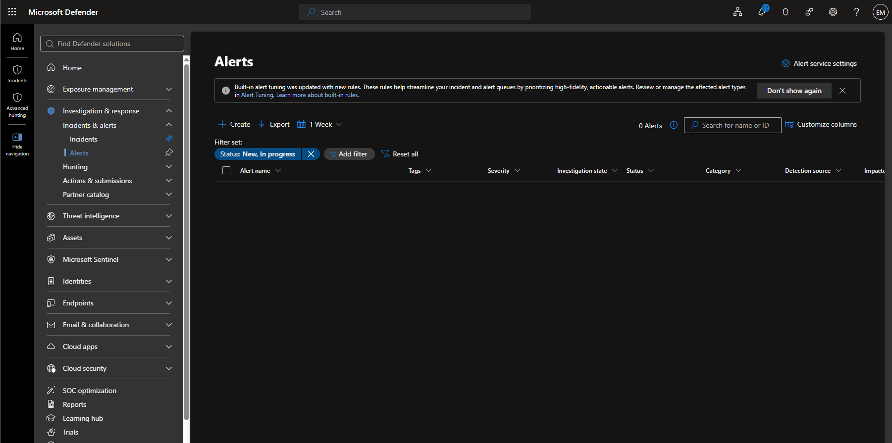

# Manage Incidents and Alerts

## Overview

Microsoft Defender Incidents and Alerts provide centralized visibility into security events across the Microsoft 365 environment. Administrators can review alerts, investigate incidents, assess affected assets, and monitor security activity from a unified dashboard.

## Location

**Microsoft Defender Portal → Investigation & Response → Incidents & Alerts**

## Steps

1. Signed in to the Microsoft Defender Portal using an administrator account.
2. Completed the Microsoft Defender for Business onboarding process.
3. Configured email notifications for incidents and vulnerabilities.
4. Reviewed onboarding options for Windows device integration.
5. Applied recommended Microsoft Defender security settings.
6. Opened the **Incidents** dashboard.
7. Reviewed the incident management interface.
8. Reviewed available incident filters and investigation capabilities.
9. Opened the **Alerts** dashboard.
10. Reviewed available alert management options.
11. Verified that no incidents were present in the lab environment.
12. Verified that no alerts were present in the lab environment.
13. Confirmed that Microsoft Defender onboarding was successfully completed and the environment was ready for future incident and alert generation.

## Result

Microsoft Defender Incidents and Alerts were successfully accessed and reviewed. At the time of testing, the lab environment did not contain any active incidents or alerts. Microsoft Defender onboarding was completed to support future security monitoring, alerting, and incident investigation activities.

### Configured email notifications 

### Access Incidents and Alerts

## Administrative Notes

Incidents and Alerts provide administrators with centralized visibility into security events occurring throughout the Microsoft 365 environment.

Microsoft Defender correlates related alerts into incidents to streamline investigation workflows and improve security operations efficiency.

Newly onboarded or low-activity lab environments may not immediately generate incidents or alerts. As devices, users, and workloads begin generating security telemetry, incidents and alerts will become available for investigation and response activities.