# Manage Anti-Spam

## Overview

Microsoft Defender for Office 365 Anti-Spam policies help protect users from spam, phishing, spoofing, and bulk email by applying advanced filtering controls to inbound email before delivery to user mailboxes.

## Location

**Microsoft Defender Portal → Email & Collaboration → Policies & Rules → Threat Policies → Anti-spam**

## Steps

1. Signed in to the Microsoft Defender Portal using an administrator account.
2. Navigated to **Email & Collaboration**.
3. Selected **Policies & Rules**.
4. Selected **Threat Policies**.
5. Selected **Anti-spam**.
6. Selected **Create Policy**.
7. Selected **Inbound Policy**.
8. Entered the policy name **Corporate Anti-Spam Protection Policy**.
9. Entered a policy description.
10. Assigned the policy to **All Recipients**.
11. Configured the **Bulk Email Threshold** to **6**.
12. Configured advanced spam scoring options for suspicious URLs and links.
13. Configured spam detection settings for potentially malicious email characteristics.
14. Configured spam actions.
15. Configured phishing actions.
16. Configured high confidence phishing actions.
17. Configured quarantine policies.
18. Enabled **Spam Safety Tips**.
19. Enabled **Zero-hour Auto Purge (ZAP)** protection.
20. Reviewed the Allow and Block List configuration.
21. Reviewed the Anti-Spam policy settings.
22. Selected **Create** to deploy the policy.
23. Received a **Client Error** message during policy creation.
24. Performed troubleshooting to identify the root cause.
25. Verified licensing, permissions, and configuration settings.
26. Documented findings and moved the issue to the backlog for future investigation.

## Result

An Anti-Spam policy was configured and validated; however, policy creation failed due to a Microsoft Defender client error. Initial troubleshooting did not identify a configuration issue, and the item was moved to the backlog for further investigation.

### Access Anti-Spam Policies

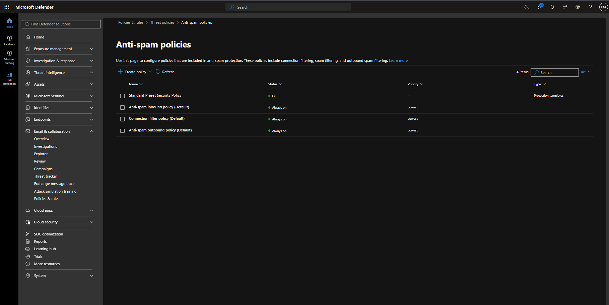

### Review Existing Anti-Spam Policies

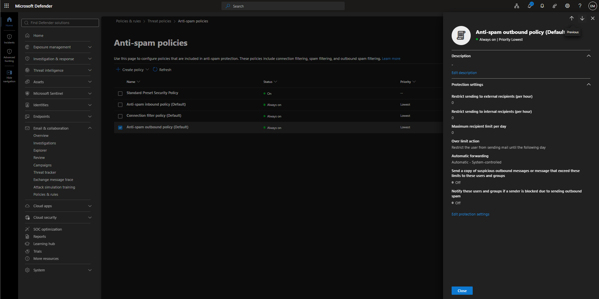

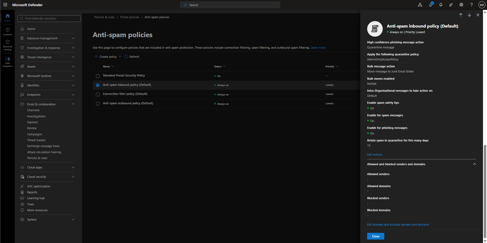

### Create Anti-Spam Policy

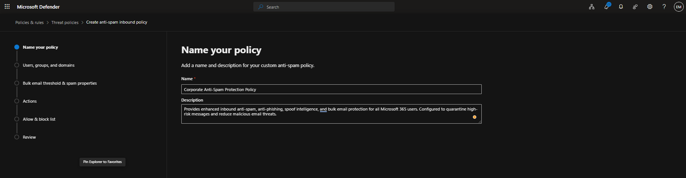

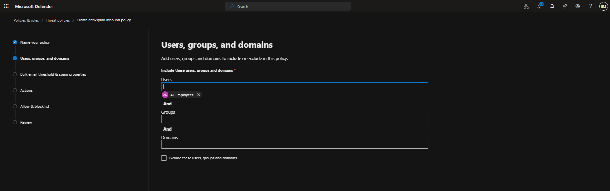

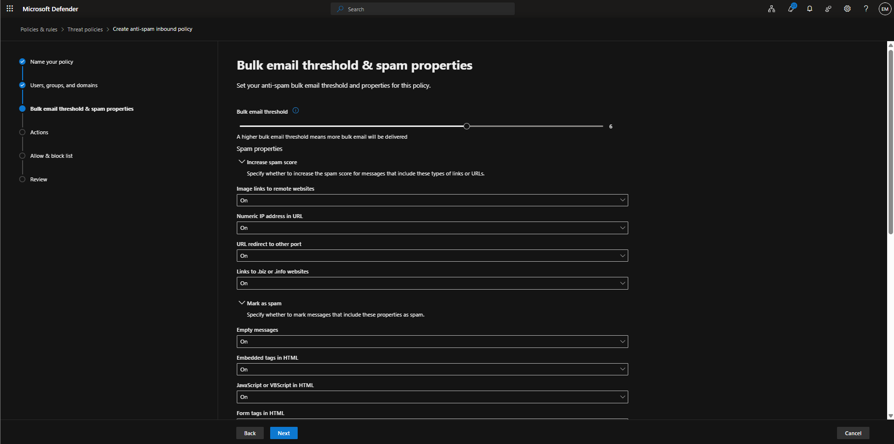

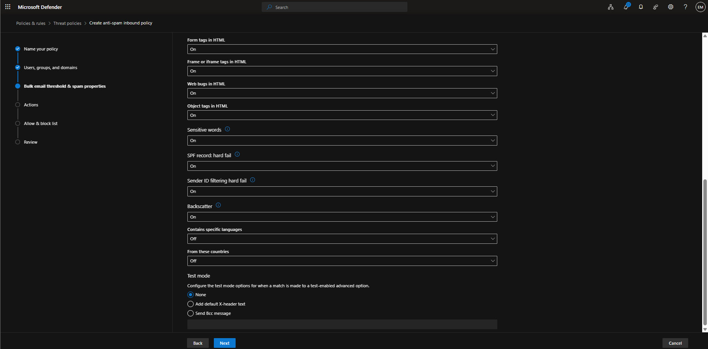

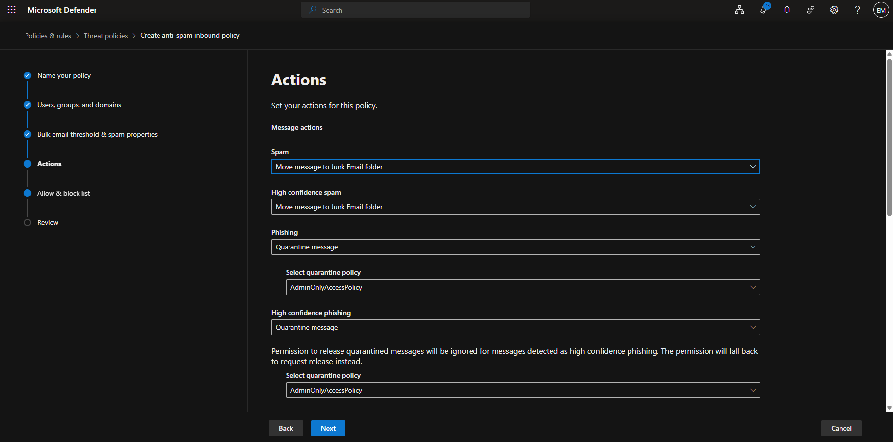

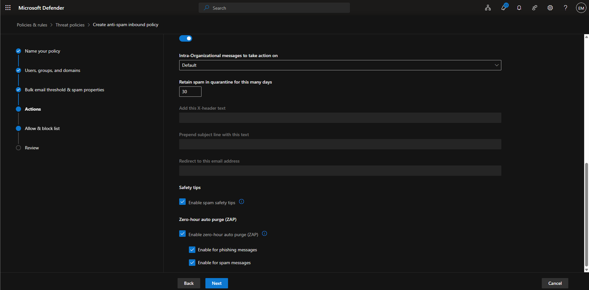

### Review Anti-Spam Policy

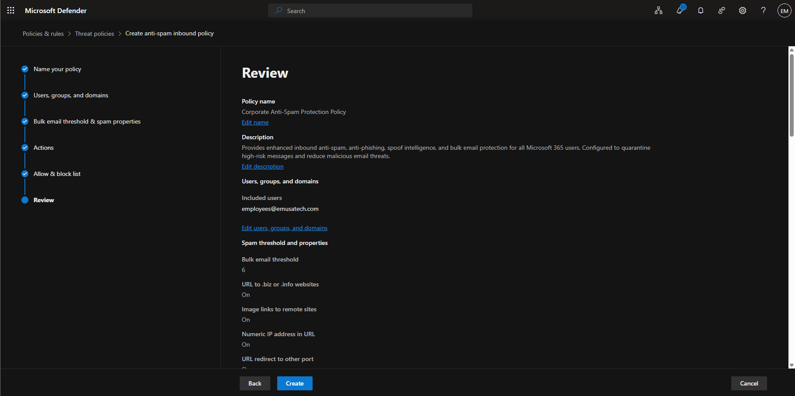

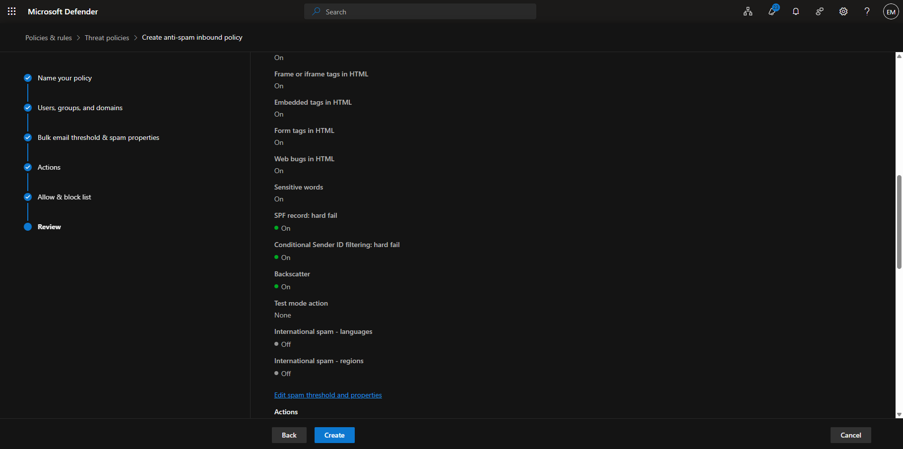

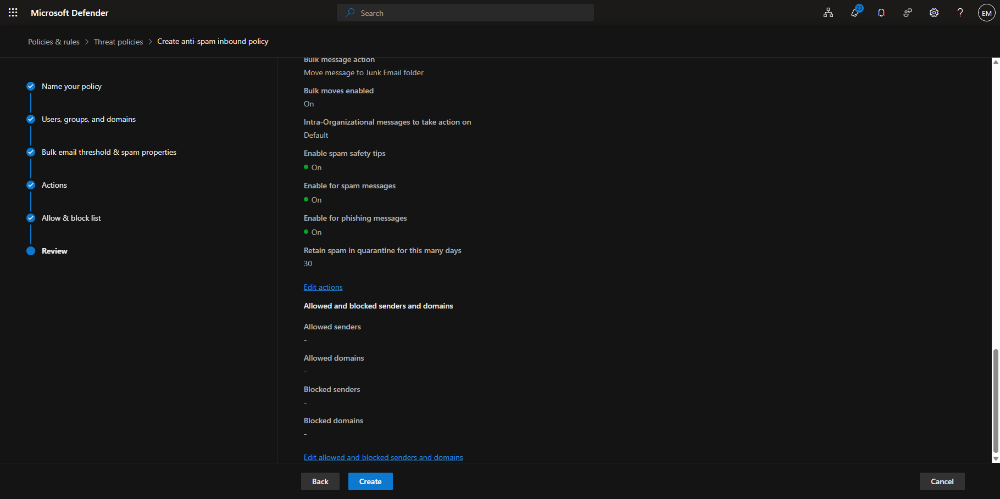

### Client Error

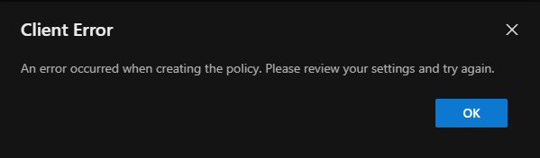

## Administrative Notes

1. Verified that the administrator account was assigned the **Global Administrator** role.
2. Verified that **Microsoft Defender for Office 365 (Plan 2)** was assigned to the administrator account.
3. Verified that **Microsoft 365 Business Premium** was assigned to the administrator account.
4. Reconfigured quarantine actions to use **DefaultFullAccessPolicy**.
5. Retested Anti-Spam policy creation.
6. Attempted to create an Anti-Phishing policy to determine whether the issue was specific to Anti-Spam policies.
7. Observed that Anti-Phishing policy creation also failed with a similar client error.
8. Reviewed Anti-Spam policy settings for potential configuration issues.
9. Confirmed that the issue was not related to permissions or assigned licensing.
10. Determined that the issue might be related to tenant provisioning or a Microsoft service-side condition.
11. Added the issue to the project backlog for future investigation.

## Administrative Notes

Anti-Spam policies help protect Microsoft 365 users from unsolicited, phishing, spoofed, and bulk email messages.

Microsoft Defender for Office 365 uses machine learning, reputation analysis, threat intelligence, and spoof intelligence to identify potentially malicious email before delivery.

When persistent policy creation errors occur despite valid licensing and administrative permissions, administrators should validate service provisioning, review Microsoft 365 service health, and document findings for future investigation or escalation.