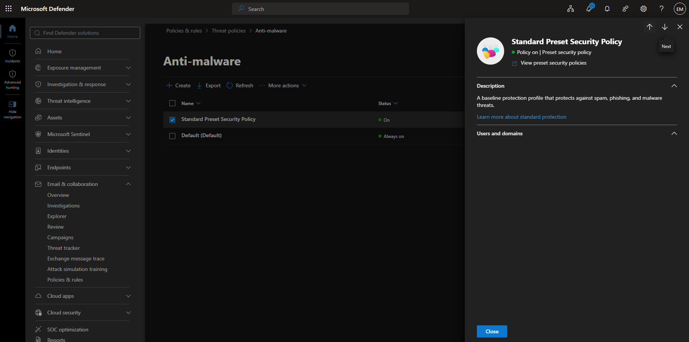
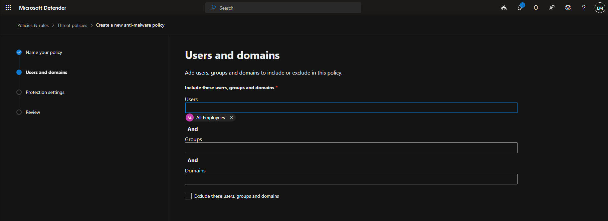
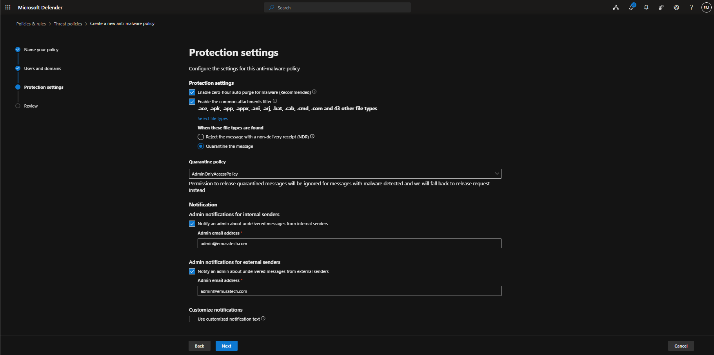
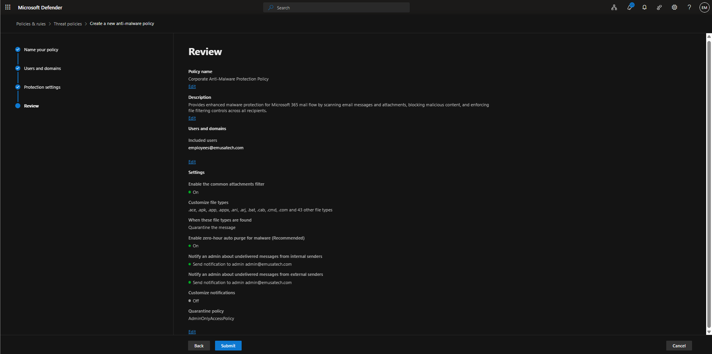
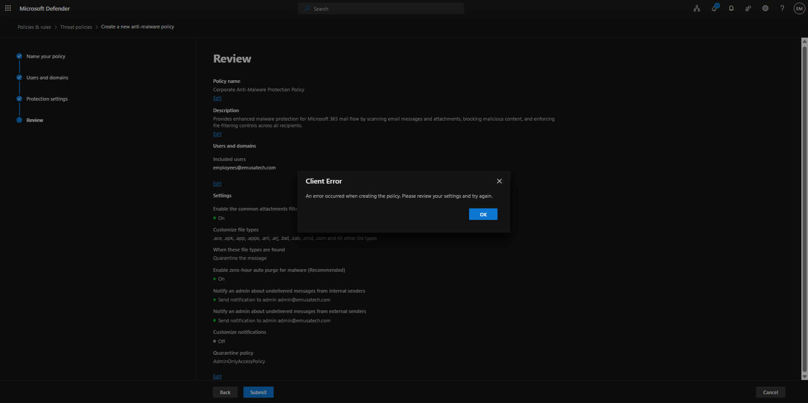

# Manage Anti-Malware

## Overview

Microsoft Defender for Office 365 Anti-Malware policies help protect users by scanning email messages and attachments for malware, viruses, ransomware, and other malicious content before delivery to user mailboxes.

## Location

**Microsoft Defender Portal → Email & Collaboration → Policies & Rules → Threat Policies → Anti-malware**

## Steps

1. Signed in to the Microsoft Defender Portal using an administrator account.
2. Navigated to **Email & Collaboration**.
3. Selected **Policies & Rules**.
4. Selected **Threat Policies**.
5. Selected **Anti-malware**.
6. Selected **Create Policy**.
7. Entered the policy name **Corporate Anti-Malware Protection Policy**.
8. Entered a policy description.
9. Assigned the policy to **All Recipients**.
10. Enabled the **Common Attachments Filter**.
11. Configured the action to **Quarantine the message** when blocked file types were detected.
12. Selected **AdminOnlyAccessPolicy** as the quarantine policy.
13. Enabled administrator notifications for internal senders.
14. Enabled administrator notifications for external senders.
15. Enabled **Zero-hour Auto Purge (ZAP)** for malware protection.
16. Reviewed the Anti-Malware policy configuration.
17. Selected **Create**.
18. Received a **Client Error** message during policy creation.
19. Performed troubleshooting to identify the root cause.
20. Documented findings and moved the issue to the backlog for future investigation.

## Result

An Anti-Malware policy was configured and validated; however, the policy could not be created due to a Microsoft Defender client error. Troubleshooting was performed and the issue was determined to likely be tenant-side or service-side. The topic was moved to the backlog for future investigation.

### Access Anti-Malware

### Create Anti-Malware Policy

### Review Anti-Malware Settings

### Client Error

## Troubleshooting

1. Verified that the administrator account was assigned the **Global Administrator** role.
2. Verified that **Microsoft Defender for Office 365 (Plan 2)** was assigned.
3. Verified that **Microsoft 365 Business Premium** was assigned.
4. Attempted to create a new Anti-Malware policy using recommended production settings.
5. Reviewed Common Attachments Filter and quarantine configuration.
6. Tested policy creation using **AdminOnlyAccessPolicy**.
7. Received a **Client Error** during policy creation.
8. Compared the issue with previously encountered failures when creating Anti-Spam policies.
9. Compared the issue with previously encountered failures when creating Anti-Phishing policies.
10. Confirmed that multiple Microsoft Defender policy types were affected.
11. Determined that the issue was not likely related to licensing or administrative permissions.
12. Determined that the issue might be related to tenant provisioning, Microsoft Defender backend services, or an unresolved service-side condition.
13. Moved the topic to the backlog pending future investigation.

## Administrative Notes

Anti-Malware policies help protect Microsoft 365 users from malware, ransomware, viruses, and other malicious content delivered through email.

Microsoft Defender for Office 365 scans messages and attachments using advanced detection technologies and file filtering capabilities to prevent malicious content from reaching user mailboxes.

Administrators should regularly review Anti-Malware policies, quarantine activity, and malware reports to ensure protection settings remain aligned with organizational security requirements and evolving threats.